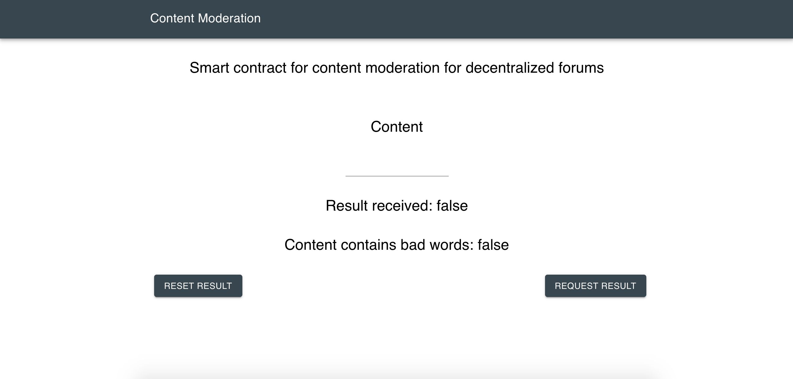

# Content Moderation
Smart contract for content moderation for decentralized forums

## Chainlink Oracle
Uses NeutrinoAPI (bad-word-filter) from [Honeycomb API Marketplace](https://developer.honeycomb.market/browse-apis)

## Screenshots


## Getting Started

1) Install [npm](https://www.npmjs.com/get-npm)

2) Install Truffle globally
   ```
   npm install -g truffle
   ```
   
3) Install the Metamask add-on to your browser and create a wallet.

   Note down the mnemonics.
   Fund it with [Ropsten ETH](https://faucet.metamask.io/) and [Ropsten LINK](https://ropsten.chain.link/).
   
4) Create an [Infura](https://infura.io/) account, get an endpoint URL for the Ropsten testnet and note it down.    
   
5) Clone repo
   ```
   https://github.com/viraja1/content_moderation.git
   ```
 
6) Change directory
   ```
   cd content_moderation
   ```
    
7) Install the dependencies
   ```
   npm install
   ``` 
    
8) Create the file where you are going to enter your Infura credentials
   ```
   cp wallet.json.example wallet.json
   ```   
   Open the newly created `wallet.json` file and enter the mnemonics and the infura endpoint URL you have noted down earlier, similar to `wallet.json.example`.
     
9) Deploy the contract (Ropsten LINK will be transferred from your wallet to the contract automatically during deployment)
   ```
   npm run deploy-ropsten
   ```
    
10) Go to the front-end project directory
    ```
    cd client
    ```
    
11) Install the dependencies for the front-end project
    ```
    npm install   
    ```
     
12) Start the server
    ```
    npm start
    ```
     
13) Fund your contract with more Ropsten LINK if required using metamask    